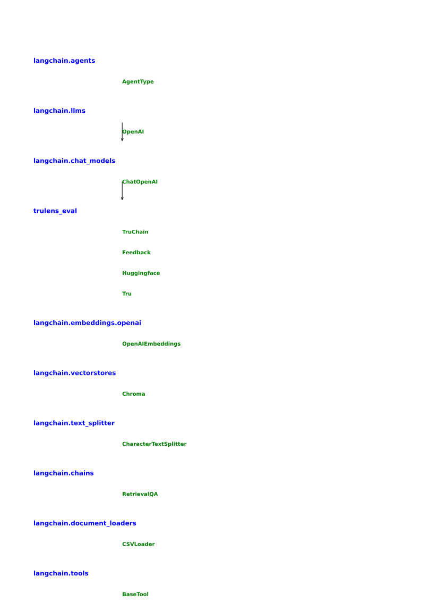
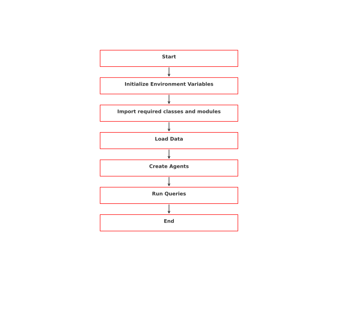
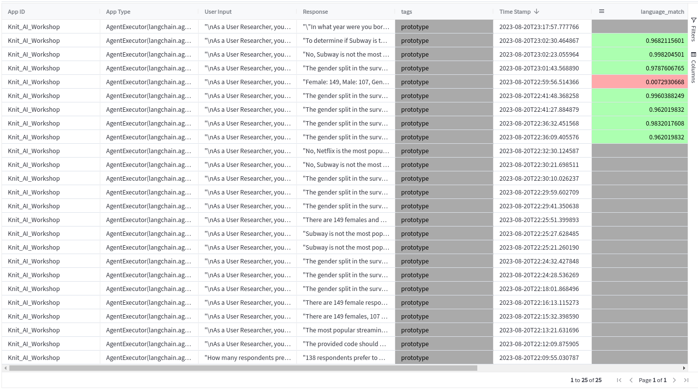

# AI Workshop: Rachitt Shah 

## Data cleaning and transformation:
In addition to the transformations mentioned, I have also converted the JSONs into CSVs to make them more amenable for the LLMs. This conversion was crucial due to different schemas in the JSON files. One notable discrepancy was a question in the Questions JSON about the spacing out of episode airing frequencies, which did not have a corresponding key in the Responses JSON.

I've done some data cleaning and transformation to make the data more suitable for analysis. The following steps were taken:

- Converted the JSONs as a dataframe, instead of merging them into a single JSON by brute force.
- Removed the options, since response keys gave the model enough information to predict the response.
- Missing data: in responses_1.json, the key 18_1 had  music preferences, and there was no question for this. Alongside, questions_1 was missing answers for "Of the below, which do you prefer?", which I've removed into the transformed dataframe.
- In responses_2, there's null values, which have been removed.

## Approaches:
For my first approach, I decided to directly feed the CSVs to the agents. This proved to be the most straightforward method for a quick demonstration. Two main strategies were explored:

1. **Chat Models**: These models are optimal for qualitative data. They can produce excellent results but are relatively expensive. The challenge with these models is that they might miss certain actions and need precise prompting. Among the models I tested, GPT-4 stood out as the best performer. However, it's also the priciest. GPT-3.5 offers a good balance between performance and cost, but it's still on the expensive side.

2. **Instruct Models**: The `text-davinci-003` model, an instruct-tuned model, showed promising results with quantitative data. It excels at straightforward queries, such as determining gender splits. However, it's constrained by token size and might produce hallucinations when given more intricate prompts.

A hybrid approach involving prompt selectors by Langchain is also considered promising. These selectors can invoke the most suitable model for a given task. This approach is especially beneficial for production-scale deployments and cost optimization.

I've tried two approaches to solve this problem:

- Directly using the pandas agents.
- Using the Vectordb+autonomous.ai agents.

## Chat Template Improvement
For a system intended for production scale, the CustomChatTemplate from Langchain is highly recommended. It offers greater flexibility and is tailored for extensive deployments.

## Toolkits
When deciding on the toolkits to use, I opted for pandas agents over llm-math due to the following reasons:

- LLM-Math isn't optimized for managing large datasets or executing intricate operations, a domain where pandas excels.
- Implementing LLM-Math would require a complete overhaul of the current implementation.

Furthermore, I utilized various tools and libraries, such as Langchain, for embeddings, document loading, and text splitting, to enhance the system's capabilities.

## Application improvements and shortcomings

- Adding Prompt Caching: Cache requests and store them in a vectorstore. This will reduce the LLM API call cost since we can just return cached requests. Proposed library to use is [GPTCache](https://github.com/zilliztech/GPTCache)
- Key rotation and fallback LLMs: due to a lack of API keys, i wasn't able to apply fallback keys and LLMs. This approach will improve the reliablity of the application, and allow the user to experience lower downtime then usual, and i wished to [BerriAI](https://github.com/BerriAI/reliableGPT) for the same with [LiteLLM](https://github.com/BerriAI/litellm).
- OSS embeddings: reduce the cost for embeddings generation via using OSS embeddings which can reduce costs further. Langchain embeddings can be used for this purpose.
- Use Retrival Augmented Generation: Use [RAG](https://github.com/explodinggradients/ragas)
- Output formatting using [Guardrails.ai](https://docs.getguardrails.ai/) to format outputs and reduce hallucinations.
- Evals: Can be improved by using a better metric.
- Support for OSS LLMs: for enterprise data localization, using OSS LLMs is better choice.
- Adding Logging: Use Portkey.ai or Vellum.ai for logging and monitoring.

- Secuity and data privacy: Use Azure ChatGPT to ensure data privacy and security.

### Deployment as SDK:

I've added boilerplate code to deploy as an SDK.

my_sdk/
│
├── environment/
│   ├── __init__.py
│   └── setup.py
│
├── data/
│   ├── __init__.py
│   └── loader.py
│
├── analysis/
│   ├── __init__.py
│   └── analyzer.py
│
├── visualization/
│   ├── __init__.py
│   └── visualizer.py
│
└── __init__.py

